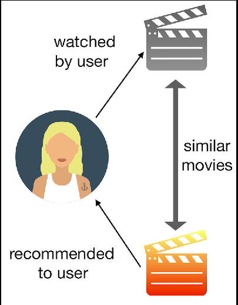
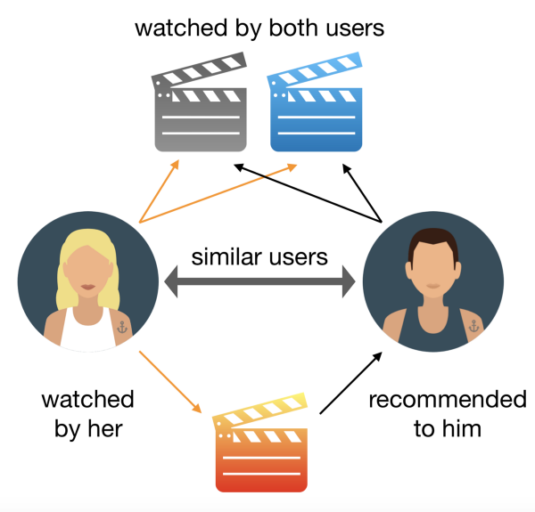

## Movie Recommendation System

&nbsp;

* At some point each one of us must have wondered where all the recommendations that Netflix, Amazon, Google give us, come from. We often rate products on the internet and all the preferences we express and data we share (explicitly or not), are used by recommender systems to generate, in fact, recommendations. The two main types of recommender systems are either collaborative or content-based filters: these two names are pretty self-explanatory, but let’s look at a couple of examples to better understand the differences between them. I will use movies as an example (because if I could, I would be watching movies/tv shows all the time), but keep in mind that this type of process can be applied for any kind of product you watch, listen to, buy, and so on.

&nbsp;

&nbsp;

### Why Recommendation System ?

&nbsp;

* Here's the list of advantages:
    * Increase in sales due to better personalized offers.
    * Enhanced customer experience.
    * More time spent on the plateform.
    * Customer retention.

&nbsp;

* A recent study by Epsilon found that 90% of consumers find personalization appealing. Plus, a further 80% claim they are more likely to do business with a company when offered personalized experiences.

&nbsp;

* The study also found that these consumers are 10x more likely to become VIP customers, who make more than 15 purchases per year.

&nbsp;

* The moral of the story? If you’re interested in cross selling or serving personalized offers, a recommendation system is right for you.

&nbsp;

### Types of Recommendations System

&nbsp;

* Content Based Filtering

&nbsp;

* Collaborative Filtering

### Content Based Filtering

&nbsp;

&nbsp;

### Collaborative Based Filtering

&nbsp;

&nbsp;

#### The included notebook contains the implementations of content and collaborative filtering based recommendations system.
